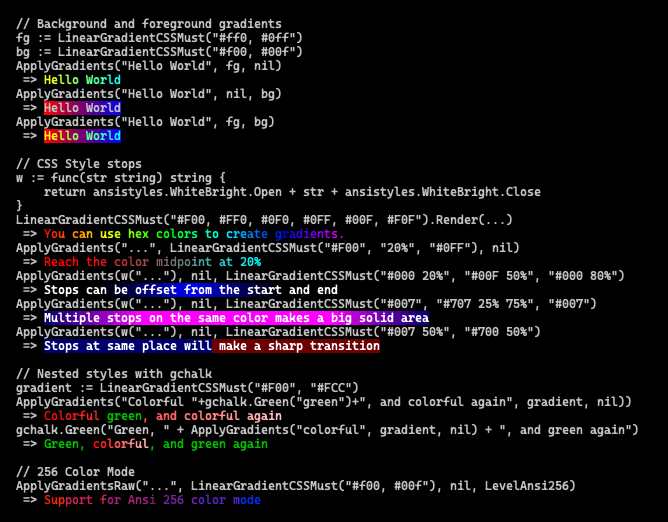

# ansigradient

`ansigradient` is a library for generating color gradients using ANSI escape codes. This library can be used to create gradients, and then to apply those gradients (or any arbitrary collection of colors) to a string.



## Features

- Support for [16.7m TrueColor and 256 color pallets](https://gist.github.com/XVilka/8346728)
- Full support for emoji (even [ZWJ Emoji](https://emojipedia.org/emoji-zwj-sequence/)).
- Supports nested styles with [gchalk](https://github.com/jwalton/gchalk). Can nest colors within gradients or vice-versa.
- Can autodetect color support, or explicitly specify it.

## Installation

```sh
go get github.com/jwalton/go-ansigradient
```

## Usage

To use this library, first you create a `Gradient` using the same syntax as used in CSS `linear-gradient()` (except that you can't specify a direction - they are always left-to-right).  The simplest gradient would have just two stops:

```go
// Create a gradient.
linearGradient := ansigradient.CSSLinearGradientMust("0xff0000, 0x0000ff")

// Apply a gradient to the foreground of a string of text.
text := ansigradient.ApplyGradients("Red-to-blue text", linearGradient, nil);

// Apply a gradient to the background of a string of text.
text := ansigradient.ApplyGradients("Red-to-blue text", nil, linearGradient);

// Convert a gradient to an array of Colors, then apply those colors to the text:
str := "Red-to-blue text"
colors := linearGradient.Colors(len(str))
text := ansigradient.ColorString(colors, nil, str)
```

Stops can optionally have an "offset" which will say where along the text that color will begin - an offset of `0px` or `0%` is right before the first color, and `100%` is right at the end of the last character.  The actual color of any character is computed as if the character were one pixel wide and is based on the "center" of that character (i.e. the first character gets it's color from linearly-interpolating the color at 0.5px).  As with CSS, we can also provide a stop with no color - this is used as a hint for where the midpoint between two colors should be:

```go
gradient := ansigradient.CSSLinearGradientMust("#FF0000 20%, 30%, #0000FF 80%")
```

The "ApplyGradients" and "ColorString" functions will attempt to auto-detect terminal color support based on what stdout supports.  For details about how this works, see the [supportscolor](https://github.com/jwalton/go-supportscolor) package.  You can override the level with `SetLevel()`, or if you want to apply colors to a string ignoring the current color level, you can do so with "ApplyGradientsRaw" and "ColorStringRaw":

```go
// Set the default color level:
ansigradent.SetLevel(ansigradent.LevelAnsi256)

// Force ansigradient to use the same level as gchalk:
ansigradient.SetLevel(gchalk.GetLevel())

// Render text in Ansi256 mode, ignoring the detected level:
text := ansigradient.ApplyGradientsRaw("Red-to-blue text", nil, linearGradient, ansigradent.LevelAnsi256);
```
